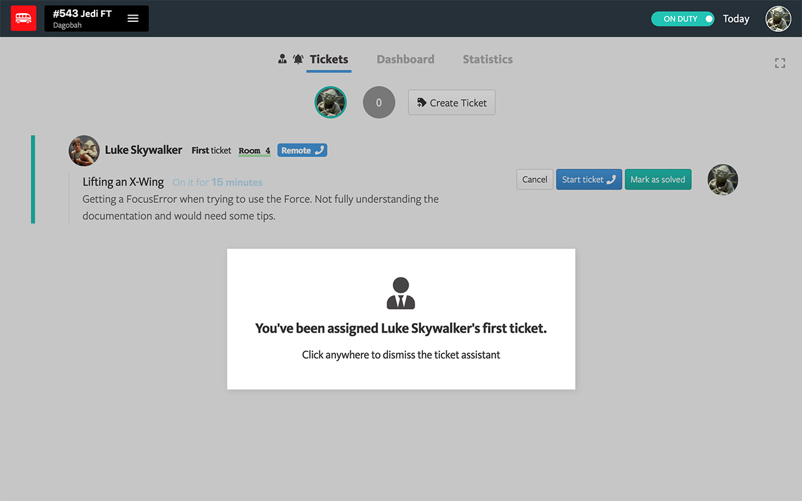

# Kitt Ticket Assistant

Voice assistant for Kitt's ticketing system to minimize the risk of a ticket going unnoticed for too long.

### Why?

When working remotely, it's relatively easy to miss the Slack notification of a new ticket. Especially if you need to be away from your computer or phone for a moment. If you're like me, you end up constantly looking over that computer or phone screen to check whether or not that last Slack message was a ticket notification, or just a new meme.

The Kitt ticket assistant will help you stay chill about those Slack notifications, while making sure you don't miss out on the important ticket notifications, by confirming with you that you've seen the ticket.

### How does it work?

- The extension will play a gentle chime sound upon assignment of a new ticket (useful in case you had your Slack notifications turned off, or if you need to have a distinct notification sound for tickets to distinguish it from normal Slack messages).
- You now need to click anywhere on the tickets page to confirm that you saw the ticket (this will dismiss the assistant).
- In the absence of your confirmation, a synthetic voice will notify you that a ticket is waiting for you. It will repeat that message every 30 seconds until you dismiss the ticket assistant.
- Note: the assistant will not notify you if you are being assigned a ticket right after finishing one. Since you would already be on the tickets page marking the last ticket as completed, the assistant assumes that you've already seen that next one coming for you, and will not bother you.

### Installation

1. Install the extension from the [Chrome Web Store](https://chrome.google.com/webstore/detail/kitt-ticket-assistant/gfjdbpckaoakgmfdnaijajlniihnlcal)
2. On the tickets page, activate the ticket assistant by clicking the icon next to the notification 
bell. Please note that by design, the ticket assistant needs to be enabled every time you load or refresh the tickets page.

You can now turn on the sound, and go away from your computer/phone to do anything else. The ticket assistant will make sure no students are kept waiting :)